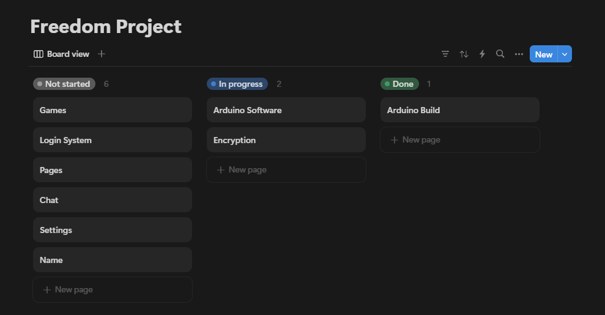

# Entry 2
##### 12/15/24

### Content

I have been tinkering with [React Native](https://reactnative.dev/) by learning to use the expo router. The Expo router is a core concept because it connects all project tabs. I have been learning through [tutorials](https://youtu.be/Z20nUdAUGmM?si=APjRSKdGY8HC8O6Z) and [documentation](https://docs.expo.dev/router/introduction/). I learned that you begin by creating a folder to hold all your pages. This concept was already close to home because I am a React developer. I then created a file to manage my layout, which references the tab folder as the location of the different project screens. Creating the project screens is the same structure as a NextJS page, which made things straightforward. I name my screen and ensure it is a `.tsx` file. You then export the page like any other React component.

```tsx
import { Text } from 'react-native';

export default function Page() {
  return <Text>Top-level page</Text>;
}
```

Additionally, I learned that I can create dynamic routes just like in Next.js, which allows for the creation of unique routes based on passed-in data, such as a username, instead of just relying on pre-made hardcoded routes.

```tsx
const UserPage = () => {
  const { id } = useLocalSearchParams<{ id: string }>();

  return (
    <View>
      <Text>User Page - {id}</Text>
    </View>
  );
};
```

One of my goals for winter break is to have a complete login in the system working with Firebase. Once I have a formal login system created with account storage information, I can start working on my other features, such as chatting and modifying a profile with a settings page. Additionally, I want to get the Bluetooth on my Arduino working and connected to my computer. The goal is for this device to eventually become smart glasses, which means it needs to be accessible, and the easiest way I can think of doing that is by having it connect with Bluetooth. However, over the past few months, I have struggled to figure out the Arduino Bluetooth protocols because there are minimal tutorials. I will be in good shape for the rest of the year if I finish this feature by the end of winter break.

### EDP
I am currently in stages **4 to 5** of the engineering design process. I have already begun planning my project and how to distribute the workload over winter break using Notion boards and written notes. Additionally, I have already begun actively creating my project files and started writing some feature code, such as encryption chat algorithms. I also already have a prototype of my Arduino side of the project, which I have been working on since the summer. The hardware MVP is complete, but I am still working on implementing all the software, particularly because I am having issues with Bluetooth.

### Skills
One of the skills I have grown in is **organization**. When I first started working on my project, I wasn't formally keeping track of what was completed, which made me unsure of how much I was progressing or what my next steps should be. However, when I created a [Notion board](https://www.notion.com/product), it allowed me to visually see what needs to get done, which helps me be more successful. Additionally, I created a tab group on my browser so I can do a better job of keeping track of documentation and tutorials so I can more efficiently work on my project. Another skill I have grown in is **how to learn**. While working on this project, my perspective on how I learn has changed. Prior to working on this project, I thought the best way for me to learn was just through writing code. However, I now realize this leads to *"tutorial hell."* To improve on this skill, I have reflected and realized that taking notes works really well for me. I try to take good notes when watching a video and then work on coding instead of just strictly following along to a tutorial.



[Previous](entry01.md) | [Next](entry03.md)

[Home](../README.md)
