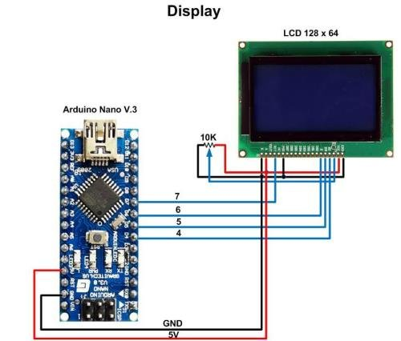

# Tool Learning Log

## Tool: **React Native**

## Project: **Mobile App for Seniors**

---

### 10/5/24:

- Discovered that expo is the most popular framework for React Native, promoted on the official documentation
- React Native allows you to compile apps into ios and android
- Learned that big apps such as discord are build on react native
- Was successfuly able to setup test project
- Learned that you can test run app on mobile by scanning qr code in terminal and downloading expo app
- Tomorrow I am going to start following the tutorial
- Are there native swift features such as notification handling?
- https://youtu.be/gvkqT_Uoahw?si=OIrGkkBx5R22gmnD

### 10/6/24:

- Error: "Error: EMFILE: too many open files, watch
  at FSEvent.FSWatcher.\_handle.onchange (node:internal/fs/watchers:207:21)"
  - Prevents project from running
  - Fixed when I changed npm version from 10.9.0 to 9.9.3
- Similar to how Next JS has page.tsx, React Native has app/index.tsx that acts as the main page
- You use `npx expo start` to run app
  - You can press w in terminal to run app in web
  - Tried scanning qr code to run app on phone, worked
- Style elements using style objects
  ```js
  const styles = StyleSheet.create({
  container: {
   flex: 1,
   /* @tutinfo Add the value of <CODE>backgroundColor</CODE> property with <CODE>'#25292e'</CODE>.*/
   backgroundColor: "#25292e",
   alignItems: "center",
   justifyContent: "center",
  },
  text: {
   color: "#fff",
  },
  ```
- Followed doc tutorial to style and run app
- https://docs.expo.dev/tutorial/create-your-first-app/

### 10/16/24:

- https://reactnative.dev/docs/components-and-apis#user-interface
- Read about the different components
- User Interface
  - Button: Handles touches and can render on any platform
  - Switch: boolean
- List Views: can only render components that are already showing on screen
  - FlatList: Good for scrollable lists
  - SectionLists: same as flat lists but for organized sections across app
- Other
  - ActivityIndicator: dispolays loading indicator
  - Alert: launches alert dialog similar to in HTML
  - Animated: animation library to create animations in apps
  - Modal: used to prevent content from going beyond a specific point on the screen
- I want to research more into the IOS specific components

### 10/18-22/24:

- Watched tutorial on basic To-DO list in react native
- https://youtu.be/0kL6nhutjQ8?si=oLlfbnAyKeS8qudO
- Modified the CSS to learn how styles works
- Had a challenging time understanding how to set the tasks without using an array and then realized it was the same as regular Next JS or React Development where you need to use components
- Realized that my component knowledge of react carries over here
- Was able to test app in the web
- How to make responsive across screen sizes? Is it any different then just using flex?

```tsx
const [task, setTask] = useState("");
const [tasks, setTasks] = useState<string[]>([]);

const addTask = () => {
  if (task.trim()) {
    setTasks([...tasks, task.trim()]);
    setTask("");
  }
};

const deleteTask = (index: number) => {
  const newTasks = tasks.filter((_, i) => i !== index);
  setTasks(newTasks);
};
```

### 10/27/24:
- https://youtu.be/HuwQwNDLaJ8?si=WWWbIhycAxxUUeML
- Learned how to navigate between different screens in React Native
- `initialRouteName` is what page the application should start on
- `Stack.Navigator` contains all the screens of the app
- Component is similar to a navbar
- Did not have a lot of time this week to work with app but want to work on implementing `NavigationContainer` in app and do further testing
- A-ha moment was realizing that you can have multiple screens but still need to set the initial route so app knows where to start
```tsx
<NavigationContainer>
  <Stack.Navigator initialRouteName="Home">
    <Stack.Screen name="Home" component={HomeScreen} />
    <Stack.Screen name="Test" component={TestScreen} />
  </Stack.Navigator>
</NavigationContainer>
```

### 11/3/24:
* Followed along to arduino introduction course
* Got display to output text
* Created a system to chunk messages every 84 characters to ensure message can be properly displayed and provide a queue
* Created a local dashboard using Node JS to send messages to the arduino while connected to computer
* Lost the code when re-setting my laptop :(
* https://www.youtube.com/watch?v=yi29dbPnu28&feature=youtu.be
* 
* 

### 11/18/24:
* Learned how to use buttons with arduino
* Learned hwot to read a circuit diagram
  * Terms such as GND (Ground), 5V (5 Vault Pin), 3.3V (3.3 Vault Power Pin)
  * VIN, 5V, GND all deal with power
  * Rectangles with ohms are resistors and use omega symbol
  * LEDs are frequently marked with polarity symbols
  * Lines are wires
* https://youtu.be/yBgMJssXqHY?si=y9ude-IU6YvguwuI
* https://youtu.be/0ZXYRU9KPG8?si=2b4cV8K4ECmHQGVY
* https://youtu.be/3zKvDF1cUYc?si=SIMUCeGfvLPe0F7e
```cpp
const int buttonPin = 2;
const int ledPin = 13;
bool ledState = false;
bool buttonPressed = false;

void setup() {
  pinMode(buttonPin, INPUT_PULLUP);
  pinMode(ledPin, OUTPUT);
}

void loop() {
  int buttonState = digitalRead(buttonPin);

  if (buttonState == LOW && !buttonPressed) {
    buttonPressed = true;
    ledState = !ledState;
    digitalWrite(ledPin, ledState ? HIGH : LOW);
  }

  if (buttonState == HIGH) {
    buttonPressed = false;
  }
}
```

11/24/25:
* Learned how to use the expo router in React Native
* Setup is similar to router in React JS
```tsx
import { Stack } from "expo-router";

const RootLayout = () => {
  return (
    <Stack>
      <Stack.Screen
        name="(tabs)"
        options={{
          headerShown: false,
        }}
      />
    </Stack>
  );
};

export default RootLayout;
```
* Create a `(tabs)` folder to hold
* `index.tsx` within the tabs folder is the home page
```tsx
import { Link, router } from "expo-router";
import { Pressable, Text, View } from "react-native";
```
* https://youtu.be/Z20nUdAUGmM?si=APjRSKdGY8HC8O6Z
* Create dynamic directories the same way as in Next JS with `[id].tsx`
```tsx
const UserPage = () => {
  const { id } = useLocalSearchParams<{ id: string }>();

  return (
    <View>
      <Text>User Page - {id}</Text>
    </View>
  );
};
```

### 12/1/24 - 12/7/24:
* Started researching encryption algorithms and studied other apps such as WhatsApp
* Encrypted message is called a cipher
* Once a password goes through an encryption algorithm it is called a hash
* Symmetric Key System
  * Not practical or commonly used
  * Everyone has the same key but can be challenging to securely distribute
* Asymmetric Key Systems
  * Uses system of public and private keys
  * Private and public keys mathematically linked together
* Advaned Encryption Standard (AES) is standard of U.S. Government
  * Used because strong against brute force attack
* Learned that salting is the concept of adding random data to a password before it is hashed to increase security
* https://www.arcserve.com/blog/5-common-encryption-algorithms-and-unbreakables-future
* https://youtu.be/NuyzuNBFWxQ?si=1C-a5Coivy2wpFq0

### 1/1/25:
* Followed tutorial to start creating firebase login component to app

```ts

const app = initializeApp(firebaseConfig);
export const auth = initializeAuth(app, {
  persistence: getReactNativePersistence(ReactNativeAsyncStorage)
});
export const db = getFirestore(app);
export const storage = getStorage(app);

```

```ts
const signUp = async () => {
    try {
        const user = await createUserWithEmailAndPassword(auth, email, password)
        if (user) router.replace('/(tabs)');
    } catch (error: any) {
        console.log(error)
        alert('Sign in failed: ' + error.message);
    }
}
```
```ts
getAuth().onAuthStateChanged((user) => {
    if (!user) router.replace('/');
  });
```
* Learned about `<SafeAreaView>` which makes sure content doesn't go off the viewing area and helps provide a content border
* Learned that some libraries require `metro.config.js` file to change default typescript behavior with apps
* Struggled with error `TypeError: (0 , _auth.getReactNativePersistence) is not a function`
* Fixed error by going on stack overflow and learning about
* Is there better way to do this?
```tsx
//@ts-ignore
import { getReactNativePersistence } from '@firebase/auth/dist/rn/index.js';
```
* https://youtu.be/a0KJ7l5sNGw?si=bVRvz_aA0Kx9QYKz
* https://stackoverflow.com/questions/76961682/typeerror-0-auth-getreactnativepersistence-is-not-a-function

<!--
* Links you used today (websites, videos, etc)
* Things you tried, progress you made, etc
* Challenges, a-ha moments, etc
* Questions you still have
* What you're going to try next
-->
